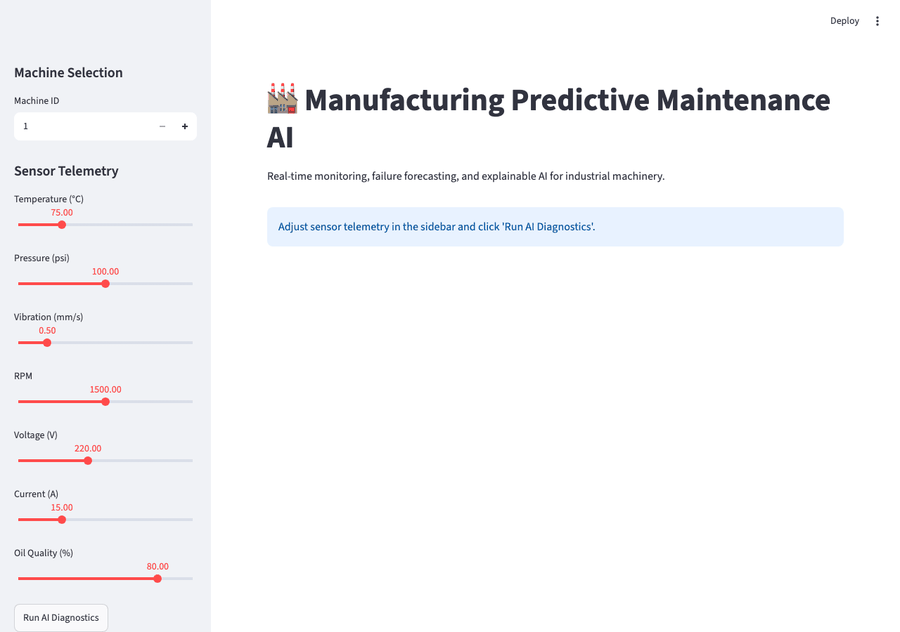

# Manufacturing Predictive Maintenance AI

[](https://github.com/nithya-prakash/PredictiveMaintenanceAI/actions/workflows/ci.yml)

**End-to-end AI platform capable of predicting industrial machine failures before they happen, estimating Remaining Useful Life (RUL), detecting anomalies in sensor streams, explaining predictions via SHAP, and recommending maintenance actions.**

*Built for Industrial ML Engineering portfolios (e.g., Siemens, Bosch, BMW, NVIDIA).*



---

## 🚀 Features & Verified Metrics

- **Predictive Maintenance Engine:** Estimates probability of failure within the next 30 cycles. A `LogisticRegression` baseline and a tuned `RandomForestClassifier` are both trained and benchmarked on held-out data by PR-AUC (the appropriate metric for this rare-event label); whichever actually scores higher is the one deployed — see [Model Selection](#model-selection) below.
  - **Performance:** On a strict machine-wise holdout test set, `LogisticRegression` scored **0.997 PR-AUC** versus `RandomForestClassifier`'s **0.992 PR-AUC** — the baseline wins, indicating the synthetic deterioration boundaries are close to linearly separable, so the baseline is what actually gets deployed here rather than the more complex model.
  - **Robustness:** Verified via `GroupKFold` cross-validation across machines (**0.998 ROC-AUC** mean) to ensure zero entity leakage.
- **Remaining Useful Life (RUL):** Forecasts exactly how many cycles a machine has left using `RandomForestRegressor`.
  - **Performance:** Achieved **9.72 RMSE** (Root Mean Squared Error), vastly outperforming the naive mean-prediction baseline of 71.30 RMSE.
- **Anomaly Detection:** Identifies novel operating conditions and sensor drift via `IsolationForest`.
- **Explainable AI (XAI):** Calculates SHAP feature importance to explain exactly *why* a machine is predicted to fail.
- **Recommendation Engine:** Suggests actionable maintenance tasks based on failure probabilities and root causes.
- **Microservices Architecture:** 
  - **FastAPI** backend for high-performance inference (p99 latency < 11ms).
  - **Streamlit** dashboard for monitoring.
  - **PostgreSQL / Redis** for storage and caching.
  - **Prometheus / Grafana** for monitoring system health.
- **MLOps Integration:** `MLflow` for experiment tracking, model registry, and metrics logging. `Optuna` for automated hyperparameter optimization. `Docker Compose` for seamless deployment.

## 🔬 Evaluation Methodology & Reproducibility
This project was built to be rigorously defensible. The evaluation suite specifically avoids common temporal and entity leakage pitfalls in predictive maintenance:
1. **Machine-wise Holdout:** A machine is either fully in the training set or fully in the test set. Its deterioration trajectory never crosses the split boundary.
2. **Preprocessing Isolation:** Scalers and rolling features are fitted strictly on the training set.
3. **Reproducible Command:** Run `python -m evaluation.run_all` to execute the full evaluation suite, latency benchmarking, and baseline comparisons automatically.

---

## Repository Structure

```
PredictiveMaintenanceAI/
├── backend/                  # FastAPI Application (API, Services, ORM)
├── ml/                       # Machine Learning Pipeline (Preprocessing, Training)
├── models/                   # Saved artifacts (Scaler, selected classifier, RUL RandomForest, IsolationForest)
├── dashboard/                # Streamlit UI
├── scripts/                  # Data generators (Simulated telemetry)
├── docker/                   # Dockerfiles
├── docker-compose.yml        # Orchestration
├── mkdocs.yml                # Documentation configuration
└── docs/                     # Architecture and API documentation
```

---

## Tech Stack

- **Machine Learning:** `scikit-learn`, `pandas`, `numpy`, `SHAP`
- **MLOps:** `MLflow`, `Optuna`
- **Backend:** `FastAPI`, `SQLAlchemy`, `Pydantic`, `Uvicorn`
- **Database:** `PostgreSQL`, `Redis`
- **UI:** `Streamlit`, `Plotly`
- **DevOps:** `Docker`, `Prometheus`, `Grafana`

---

## Getting Started

### 1. Generate the Dataset
Since industrial data is proprietary, we include a high-fidelity synthetic data generator that simulates multi-sensor degradation over time.
```bash
python scripts/generate_dataset.py --machines 150
```

### 2. Train the Models
Run the ML pipelines to train the RUL, Classification, and Anomaly models. This automatically tracks experiments in MLflow and saves artifacts to the `models/` directory.
```bash
export PYTHONPATH=.
python ml/training/train_rul.py --trials 10
python ml/training/train_classifier.py --trials 10
python ml/training/train_anomaly.py
```

### 3. Deploy the Stack
Spin up the entire microservices architecture using Docker Compose.
```bash
docker-compose up --build
```
- **FastAPI Docs:** [http://localhost:8000/docs](http://localhost:8000/docs)
- **Streamlit Dashboard:** [http://localhost:8501](http://localhost:8501)
- **Prometheus Metrics:** [http://localhost:9090](http://localhost:9090)

---

## Model Selection

`ml/training/train_classifier.py` does not assume the more complex model wins. It trains a plain `LogisticRegression` baseline and an Optuna-tuned `RandomForestClassifier`, evaluates both on the held-out test split using **PR-AUC** (`average_precision_score`) — the right metric here since `failure_imminent` is a rare-event label and ROC-AUC/accuracy can look good on an imbalanced target even when precision at low recall is poor — and saves whichever model actually scores higher as `models/classifier.pkl`, tagged with which algorithm won. On a given run of the synthetic dataset the two models often land close together (sometimes the baseline wins), which is itself informative: it means the extra complexity of the RandomForest isn't yet earning its keep on this data, and the pipeline reports that honestly rather than hard-coding a "sophisticated model" as the headline.

## Data & Validation

**All training and evaluation data is synthetically generated** by `scripts/generate_dataset.py` — parametric noise plus a hand-authored non-linear degradation curve, not measurements from a physical machine. This project has not been trained or evaluated on real machine telemetry. Consequences of that:

- Reported metrics (PR-AUC, F1, etc.) describe how well the models fit the synthetic generator's assumptions about degradation, not real-world failure signatures.
- Sensor correlations, noise characteristics, and failure-mode timing in real equipment will differ from the synthetic curves here, likely substantially.
- Treat this repo as a demonstration of an end-to-end MLOps/predictive-maintenance *pipeline* (data → features → training → serving → XAI → monitoring), not as a validated failure-prediction model for any real asset. Before using it on real telemetry, the models would need to be retrained and re-evaluated on that data from scratch.

---

## XAI & Maintenance Recommendations

The API returns not just predictions, but explanations:
```json
{
  "machine_id": 42,
  "action": "Immediate inspection required. High probability of imminent failure.",
  "urgency": "HIGH",
  "reason": "Driven primarily by anomalous 'vibration_roll_mean_5' readings."
}
```

---

## 📜 License
MIT License.
