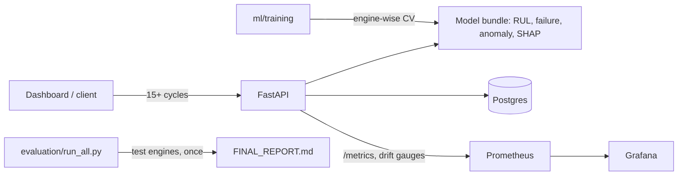
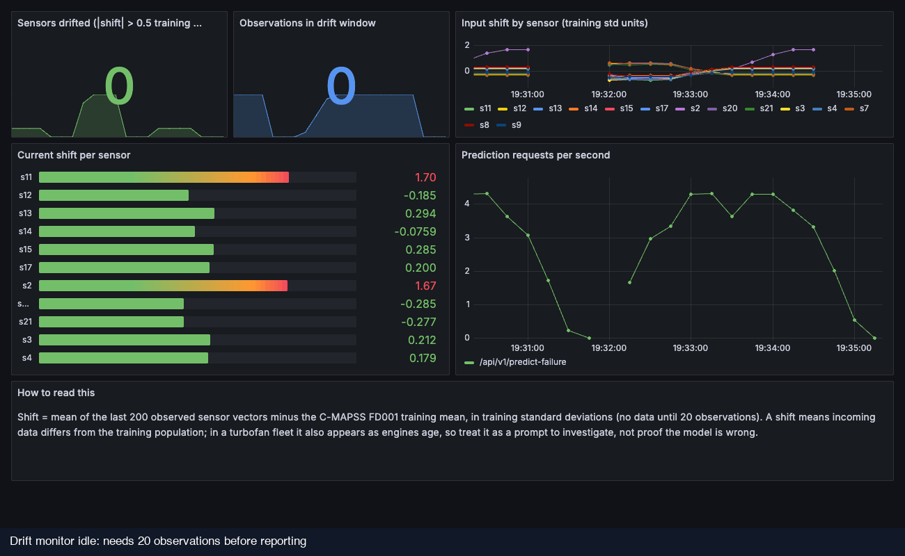

# Turbofan Predictive Maintenance AI

Predicts remaining useful life, imminent failure and anomalies for jet-engine fleets from sensor history, explains each failure risk with SHAP, and serves it through an API and dashboard for maintenance engineers.

[](https://github.com/nithya-prakash/PredictiveMaintenanceAI/actions/workflows/ci.yml) [](https://nithya-prakash.github.io/PredictiveMaintenanceAI/)  [](LICENSE)


## Headline results

NASA C-MAPSS **FD001**, the 100 official test engines, scored once. Every model choice was made with engine-wise cross-validation on the 100 training engines (`evaluation/results/FINAL_REPORT.md`).

| Measure | Result |
|---|---|
| RUL error, last cycle of each engine (labels capped at 125) | RMSE **17.19**, MAE 12.22, NASA score 573 |
| Imminent failure (RUL ≤ 30), all test cycles with 15+ cycles of history | PR-AUC **0.842**, precision 0.770, recall 0.717 at threshold 0.80 |
| 90% RUL interval coverage on test engines | 91% (±31.2 cycles) |
| API latency under load (20 users, 90 s, Locust) | p50 28 ms, p95 120 ms, p99 220 ms, 30.8 req/s, 0 failures in 2,748 requests |

Published FD001 results for deep sequence models are better (LSTM 16.14 RMSE, 1D CNN 12.61). A 1D-CNN benchmark here reaches 14.32, but the API serves the random forest. Details: [docs/details.md](docs/details.md).

## Quickstart

Needs Docker with Compose v2.

```bash
git clone https://github.com/nithya-prakash/PredictiveMaintenanceAI.git && cd PredictiveMaintenanceAI
cp .env.example .env     # set POSTGRES_PASSWORD, API_TOKEN and GRAFANA_ADMIN_PASSWORD
docker compose --profile monitoring up -d --build db api prometheus grafana
curl -s http://127.0.0.1:8001/health      # {"status":"ok","models_loaded":true,"database":true}
```

The model bundle is included, so nothing is retrained. Swagger: http://127.0.0.1:8001/docs, Prometheus: http://127.0.0.1:9090, Grafana: http://127.0.0.1:3001 (user `admin`). The Streamlit dashboard needs the 12 MB NASA data download; see [docs/details.md](docs/details.md#getting-started).

## How it works

From an engine's last 15+ consecutive cycles, the API builds 71 features (14 raw sensors, cycle count, rolling means and standard deviations over 5 and 15 cycles) and returns RUL, failure probability, an anomaly flag, SHAP contributions and a rule-based maintenance recommendation, logged to Postgres. Models: Random Forest (RUL), logistic regression (failure), Isolation Forest (anomaly), chosen by Optuna with engine-wise `GroupKFold`.


```mermaid
graph LR
    D[Dashboard / client] -->|15+ cycles| A[FastAPI]
    A --> M[Model bundle: RUL, failure, anomaly, SHAP]
    A --> P[(Postgres)]
    A -->|/metrics, drift gauges| R[Prometheus] --> G[Grafana]
    T[ml/training] -->|engine-wise CV| M
    E[evaluation/run_all.py] -->|test engines, once| F[FINAL_REPORT.md]
```

## Usage

```bash
# Failure probability for one engine's recent history (payload format: docs/api.md)
curl -s -X POST http://127.0.0.1:8001/api/v1/predict-failure \
  -H "X-API-Key: $API_TOKEN" -H "Content-Type: application/json" -d @request.json

# Replay real test engines, including a labelled synthetic sensor offset, to move the drift gauges
API_URL=http://127.0.0.1:8001 API_TOKEN=... python -m scripts.replay_drift_demo

# Load test
locust -f loadtest/locustfile.py --host http://127.0.0.1:8001 --headless -u 20 -r 5 -t 90s

# Export the Power BI tables to bi/
python -m scripts.export_bi
```

Endpoints: `POST /api/v1/predict-rul`, `/predict-failure`, `/anomaly`, `/explain`, `/rul-trajectory`, `/recommend-maintenance`; `GET /api/v1/model-info`, `/health`, `/metrics`.

## Monitoring, load test, Kubernetes, BI



- **Drift monitoring**: `backend/services/drift.py` keeps the last 200 sensor vectors and exports each sensor's mean shift from the training mean, in training standard deviations, plus a count of sensors beyond 0.5 std. The Grafana dashboard is `configs/grafana/dashboards/drift.json`.
- **Load test**: `loadtest/locustfile.py` replays real engine windows. Result in the table above; the API and the load generator shared one laptop, so it is not a capacity test.
- **Kubernetes**: `k8s/` (Kustomize: API Deployment with probes and HPA, Postgres StatefulSet, NetworkPolicy). CI renders it and validates it with `kubeconform` (7 resources valid). Never applied to a real cluster.
- **Power BI**: `python -m scripts.export_bi` writes four star-schema CSVs to `bi/` (1.6 MB, reproducible byte for byte). Model and DAX measures: [docs/powerbi.md](docs/powerbi.md). The `.pbix` file is not included.

## Limitations

- **FD001 only** (one operating condition, one fault mode), and the data is NASA's engine simulation, not real aircraft. The failure metrics rest on 25 test engines.
- **Drift gauge reads relative to all training cycles**: on test engines at cycle 60, 9 of 14 sensors exceed 0.5 std (largest 0.65) even though the engines are healthy; at each engine's last cycle the largest shift is 0.32 and none are flagged. An alert means "the fleet's age mix or sensors changed", not "the model is wrong". The threshold was chosen a priori, not tuned.
- **Classical models**: deep sequence models are more accurate on FD001.
- The recommendation is a transparent rule on top of the models, not a learned policy. The rate limit is per API process.
- The Kubernetes manifests are validated against the schema only. The `.pbix` report is not included.
- C-MAPSS is downloaded at run time and not redistributed. An earlier synthetic-data version was replaced after an audit found target leakage; see [docs/details.md](docs/details.md#project-history).

## Repo layout

```
backend/     FastAPI app: routes, predictor, SHAP (xai.py), drift monitor, Postgres models
ml/          data download and checks, features, training, intervals, optional 1D-CNN benchmark
evaluation/  run_all.py (the only code that reads the test engines) and results/
models/      trained bundle, CNN weights, drift reference statistics
dashboard/   Streamlit app
configs/     Prometheus config, Grafana dashboards (API and drift)
k8s/         Kustomize manifests
loadtest/    Locust file
scripts/     BI export, drift reference and replay, lockfile generation
bi/          Power BI CSVs
locks/       hash-pinned dependency lockfiles per CPU architecture
docs/        MkDocs site, details.md (full results and setup), powerbi.md
tests/       35 tests
```

## Checks

```bash
docker build -f docker/Dockerfile.dev -t pdm:dev .
docker run --rm pdm:dev ruff check .
docker run --rm -e POSTGRES_PASSWORD=x pdm:dev pytest tests/    # 35 tests; 1 needs torch (optional)
```

CI (`.github/workflows/ci.yml`) runs on every push to `main` and every pull request: ruff, kubeconform on the rendered manifests, the tests against a real Postgres, the image builds with a no-secrets check, and a Compose start-up check.

## Roadmap and license

Possible next steps: FD002–FD004 in the served model, a reference window that matches the fleet's age mix, a real cluster deployment. MIT licensed ([LICENSE](LICENSE)).
