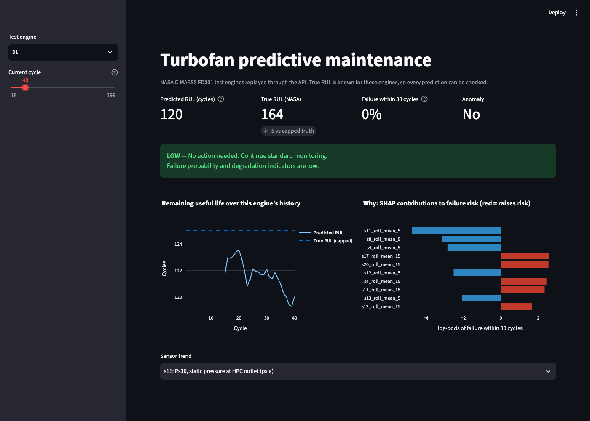

# Turbofan Predictive Maintenance AI

[](https://github.com/nithya-prakash/PredictiveMaintenanceAI/actions/workflows/ci.yml)
[](https://nithya-prakash.github.io/PredictiveMaintenanceAI/)
[](LICENSE)

An end-to-end predictive-maintenance system trained and evaluated on **NASA's C-MAPSS turbofan engine dataset (FD001)**, the standard public benchmark for remaining-useful-life (RUL) prediction. From an engine's recent sensor history it estimates remaining useful life, the probability of failure within 30 cycles, and whether the readings are anomalous; explains the failure risk with SHAP; and turns it into a maintenance recommendation. It is served by a FastAPI backend and a Streamlit dashboard that replays NASA's test engines, with Postgres logging and optional Prometheus/Grafana monitoring, all in Docker Compose.



## Results on NASA's official test set

All model choices (algorithm, hyperparameters, decision threshold) were made with **engine-wise cross-validation on the 100 training engines**. NASA's **100 official test engines** were used only once, for the numbers below (`evaluation/results/FINAL_REPORT.md`).

**Remaining useful life** — standard protocol: predict at each test engine's last cycle, with RUL labels capped at 125 cycles (piecewise-linear degradation). Lower is better; the NASA score penalises late predictions (too much life left) more than early ones.

| Model | Test RMSE | Test MAE | NASA score | CV RMSE (training) |
|---|---|---|---|---|
| **Random Forest (deployed)** | **17.19** | **12.22** | **573** | 16.93 |
| Gradient boosting (HistGB) | 17.35 | 12.44 | 580 | 17.05 |
| Linear regression | 19.31 | 14.91 | 718 | 19.22 |
| Mean-prediction baseline | 41.21 | 34.85 | 25,451 | – |

For context, published FD001 results under the same protocol ([Ragab et al. 2020](https://arxiv.org/abs/2007.09868), Table III): Random Forest 17.91 RMSE / score 480, gradient boosting 15.67 / 474, deep LSTM 16.14 / 338, 1D CNN 12.61 / 274. So the deployed model matches the published Random Forest on RMSE but scores worse on the NASA score (it predicts too much remaining life more often), and deep sequence models are clearly better. The small gap between cross-validated (16.93) and test RMSE (17.19) indicates the selection did not overfit.

**Imminent failure** (true RUL ≤ 30 cycles), on every test cycle with 15+ cycles of history:

| Model | PR-AUC | ROC-AUC | Precision | Recall | F1 |
|---|---|---|---|---|---|
| **Logistic regression (deployed, threshold 0.80)** | **0.842** | 0.994 | 0.770 | 0.717 | 0.743 |
| Gradient boosting (HistGB) | 0.820 | 0.991 | 0.665 | 0.777 | 0.717 |
| Prior (always the base rate) | 0.028 | 0.500 | – | 0 | 0 |

The deployed threshold (0.80) was chosen on out-of-fold training predictions and is exactly the one the API uses. Only 25 test engines come within 30 cycles of failure (332 positive cycles, consecutive and correlated), so these numbers carry real uncertainty; cross-validated PR-AUC on the training engines was 0.966.

**Anomaly detection** (IsolationForest learned from early-life cycles): the share of cycles flagged rises as failure approaches, 1.2% (true RUL > 125) → 8.4% (61–125) → 55.5% (31–60) → 99.1% (≤ 30).

**Latency**: p99 about 13 ms for `/predict-failure` and 15 ms for `/explain` (200 sequential requests with 30 readings each, full HTTP stack in-process on a laptop; not a production load test).

## How it works

1. **Data** (`ml/data/cmapss.py`): downloads NASA's archive and verifies its SHA-256 checksum. FD001 has 100 training engines run until failure and 100 test engines stopped before failure, with the true RUL given for their last cycle. The 7 sensors that are constant in FD001 are dropped (14 remain), as is standard.
2. **Features** (`ml/features/preprocessing.py`): per engine, the raw sensors, the cycle count, and rolling means and standard deviations over the last 5 and 15 cycles (71 features). Only cycles with a full 15-cycle history are used, and the API requires at least 15 consecutive readings, so a served prediction uses exactly the features the models were trained on (a test checks this).
3. **Training** (`ml/training/train.py`): Optuna tunes each candidate with 5-fold `GroupKFold` by engine; the best candidate by cross-validated RMSE (RUL) or PR-AUC (failure) is selected, the failure threshold is chosen on out-of-fold predictions, and everything is saved as one bundle (`models/model_bundle.joblib`) with its training metadata. MLflow logs each run locally.
4. **Evaluation** (`evaluation/run_all.py`): the only code that touches the official test engines.
5. **Serving** (`backend/`): FastAPI endpoints take an engine's recent history and return RUL, failure probability, anomaly flag, SHAP contributions, an RUL trajectory, and a maintenance recommendation (logged to Postgres).
6. **Dashboard** (`dashboard/app.py`): pick a NASA test engine and a cycle; its real sensor history is sent to the API and the prediction is shown next to the true RUL.

## Getting started

Requires Docker with Compose v2.

```bash
git clone https://github.com/nithya-prakash/PredictiveMaintenanceAI.git
cd PredictiveMaintenanceAI
cp .env.example .env            # then set POSTGRES_PASSWORD and API_TOKEN (and GRAFANA_ADMIN_PASSWORD for monitoring)
docker build -f docker/Dockerfile.dev -t pdm:dev .
docker run --rm -v "$PWD/data:/app/data" pdm:dev python -m ml.data.cmapss   # downloads C-MAPSS (12 MB) for the dashboard
docker compose up --build
```

- Dashboard: http://127.0.0.1:8501
- API docs (Swagger): http://127.0.0.1:8001/docs
- Monitoring (optional): `docker compose --profile monitoring up` → Prometheus http://127.0.0.1:9090, Grafana http://127.0.0.1:3001 (login `admin` / `GRAFANA_ADMIN_PASSWORD`, dashboard provisioned)

A trained model bundle is included, so the API runs without retraining. To retrain and re-evaluate (inside the dev image, with `-v "$PWD/data:/app/data" -v "$PWD/models:/app/models"`):

```bash
python -m ml.training.train --trials 8    # about 10 minutes on a laptop
python -m evaluation.run_all              # writes evaluation/results/
pytest tests/                             # 22 tests
```

## API

Every prediction endpoint takes the engine's most recent consecutive cycles (at least 15, oldest first):

```json
{
  "machine_id": 31,
  "readings": [
    {"cycle": 182, "s2": 643.23, "s3": 1599.84, "s4": 1419.03, "s7": 552.42, "s8": 2388.14, "s9": 9083.86,
     "s11": 47.98, "s12": 520.0, "s13": 2388.16, "s14": 8153.3, "s15": 8.506, "s17": 396, "s20": 38.54, "s21": 23.2061},
    "... 14 or more further consecutive cycles (183, 184, ...) ..."
  ]
}
```

`POST /api/v1/predict-rul`, `/predict-failure`, `/anomaly`, `/explain`, `/rul-trajectory`, `/recommend-maintenance`; `GET /api/v1/model-info`, `/health`, `/metrics`. Details in the [docs](https://nithya-prakash.github.io/PredictiveMaintenanceAI/api/).

## Engineering and security

- Postgres has no default password (compose refuses to start without one) and is not published to the host; all ports bind to `127.0.0.1`. Grafana requires a password.
- `.dockerignore` keeps `.env`, data and `.git` out of the images; CI checks this.
- If the model bundle cannot be loaded, `/health` and every prediction endpoint answer 503 with the reason. The API starts without a database and reports `persisted: false`.
- Per-client-IP rate limit (the dashboard presents `API_TOKEN` and is exempt, since all its users share one IP), explicit CORS origins, strict input validation (consecutive cycles, 15–500 readings).
- Dependencies are installed from hash-pinned lockfiles per CPU architecture (`locks/`, regenerated by `scripts/lock.sh`); the API image contains no training tools and the dashboard image no ML libraries.
- CI: ruff lint; 22 tests against a real Postgres (and a check that recommendations were persisted); image builds with a no-secrets check; a Compose start-up check.

## Limitations

- **FD001 only**: one operating condition and one fault mode. The multi-condition, multi-fault subsets (FD002–FD004) are harder and not covered.
- **Simulated engines**: C-MAPSS comes from NASA's engine simulation, not from sensors on real aircraft; it is the standard benchmark, but real fleets are noisier.
- **Classical models**: deep sequence models reach about 12–13 RMSE on FD001; this project's best is 17.19.
- **Small positive set**: failure-classification metrics rest on 25 test engines.
- The maintenance recommendation is a transparent rule on top of the models (failure probability ≥ threshold → HIGH; predicted RUL ≤ 60 or anomaly → MEDIUM), not a learned policy.
- The rate limit is per API process.

## Project history

An earlier version of this repository used a synthetic data generator. An audit found that one synthetic sensor (`oil_quality`) declined almost linearly over each machine's life and on its own predicted failure with ROC-AUC 0.989, that the API predicted from a single reading while the models were trained on rolling history (at the default threshold it caught 28.5% of imminent failures instead of 98.8%), and that hyperparameters were tuned on the test split. The project was rebuilt on NASA C-MAPSS with the protocol above; the old generator, data and metrics were removed.

## License

MIT. The C-MAPSS data is published by the NASA Prognostics Center of Excellence and is downloaded at run time, not redistributed here.
