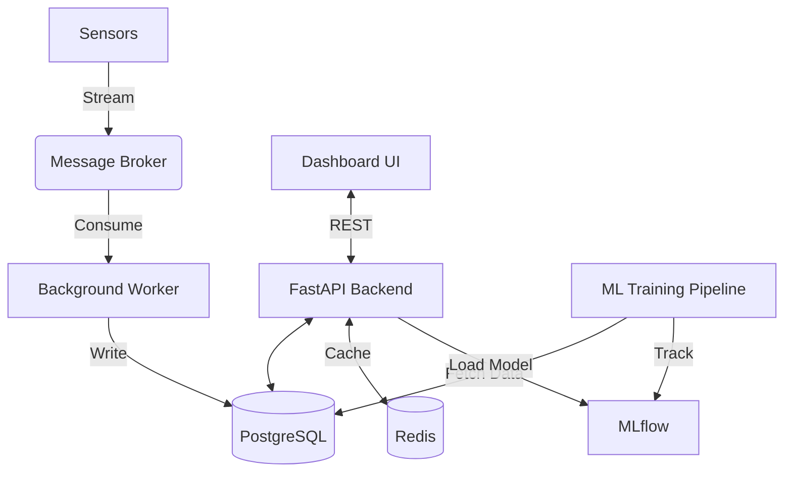

# Architecture

The Predictive Maintenance AI system uses a microservices architecture.

## System Components
1. **Message Broker (RabbitMQ/Kafka)**: Handles incoming high-frequency sensor data streams.
2. **Background Worker**: Consumes streaming data, applies rolling feature windows, and writes to PostgreSQL.
3. **Database (PostgreSQL & Redis)**: PostgreSQL stores telemetry and historical predictions. Redis acts as an in-memory cache for fast state lookups.
4. **FastAPI Backend**: Provides REST endpoints for inference and historical data retrieval. It dynamically loads the best models from the MLflow registry.
5. **Streamlit Dashboard**: A frontend interface for factory operators to view machine health and SHAP explanations.

## Data Flow

