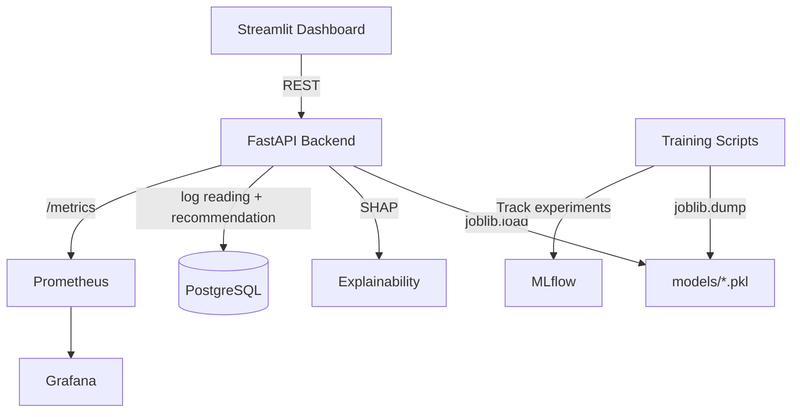

# Architecture

The platform is a small set of Docker Compose services (`docker-compose.yml`):

## System Components

1. **FastAPI Backend** (`backend/`): Serves REST endpoints for RUL, failure probability, anomaly detection, SHAP explanations, and maintenance recommendations. Loads model artifacts from `models/` at startup.
2. **Streamlit Dashboard** (`dashboard/`): Lets an operator adjust sensor telemetry and view diagnostics, calling the FastAPI backend over REST.
3. **PostgreSQL**: `POST /api/v1/recommend-maintenance` (via `backend/models/machine.py`'s ORM models) get-or-creates the `Machine` row and logs the input `SensorReading` and the resulting `Prediction`. The other endpoints (`predict-rul`, `predict-failure`, `anomaly`, `explain`) are read-only and don't write to the database.
4. **Prometheus / Grafana**: Prometheus scrapes `/metrics` on the FastAPI backend (via `prometheus-fastapi-instrumentator`); Grafana is available for dashboards on top of that data.
5. **MLflow**: Used by the training scripts (`ml/training/`) for experiment tracking, not by the serving path.

There is no message broker or background worker in this system — sensor data is sent directly to the FastAPI backend in each request; it isn't streamed through a queue.

## Request Flow

## Model Selection

`ml/training/train_classifier.py` benchmarks a `LogisticRegression` baseline against an Optuna-tuned `RandomForestClassifier` by PR-AUC and saves whichever wins as `models/classifier.pkl`, tagged with the winning algorithm. `backend/services/predictor.py` and `backend/services/xai.py` read that tag and behave accordingly (e.g. picking `TreeExplainer` vs `LinearExplainer` for SHAP) rather than assuming a specific algorithm. See [Models & XAI](models.md) for details.
