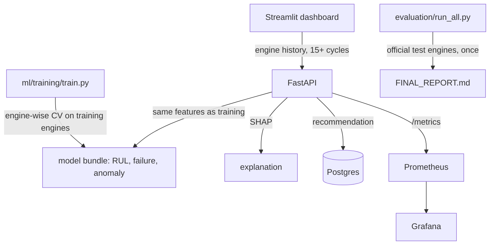

# Architecture

Docker Compose services (`docker-compose.yml`), all published on `127.0.0.1` only:

| Service | Role | Port |
|---|---|---|
| `api` | FastAPI: predictions, SHAP, recommendations; loads `models/model_bundle.joblib` | 8001 |
| `dashboard` | Streamlit: replays NASA test engines through the API | 8501 |
| `db` | Postgres: logs each recommendation (not published to the host) | – |
| `prometheus`, `grafana` | optional (`--profile monitoring`): API metrics and a provisioned dashboard | 9090, 3001 |

Training, evaluation and tests run in the dev image (`docker/Dockerfile.dev`), not in the serving containers.

## Request flow

```mermaid
graph TD
    A[Streamlit dashboard] -->|engine history, 15+ cycles| B[FastAPI]
    B -->|same features as training| C[model bundle: RUL, failure, anomaly]
    B -->|SHAP| D[explanation]
    B -->|recommendation| E[(Postgres)]
    B -->|/metrics| F[Prometheus] --> G[Grafana]
    H[ml/training/train.py] -->|engine-wise CV on training engines| C
    I[evaluation/run_all.py] -->|official test engines, once| J[FINAL_REPORT.md]
```

## Failure behaviour

- Model bundle missing or unreadable: `/health` and all prediction endpoints return **503** with the reason; nothing crashes with a 500.
- Database unreachable: the API still starts and predicts; `recommend-maintenance` returns `persisted: false`.
- Fewer than 15 readings, or non-consecutive cycles: **422**.

## Security

- No default database password: Compose refuses to start until `POSTGRES_PASSWORD` is set in `.env`. Grafana requires `GRAFANA_ADMIN_PASSWORD`.
- `.env`, data and `.git` are excluded from images (`.dockerignore`), checked in CI.
- Per-client-IP rate limit (`RATE_LIMIT_PER_MINUTE`, default 120, per API process) and explicit CORS origins. The dashboard sends `API_TOKEN` as `X-API-Key` and is exempt: all its users reach the API from one container IP.
- Hash-pinned lockfiles per CPU architecture (`locks/`); the API image has no training tools, the dashboard image no ML libraries.
